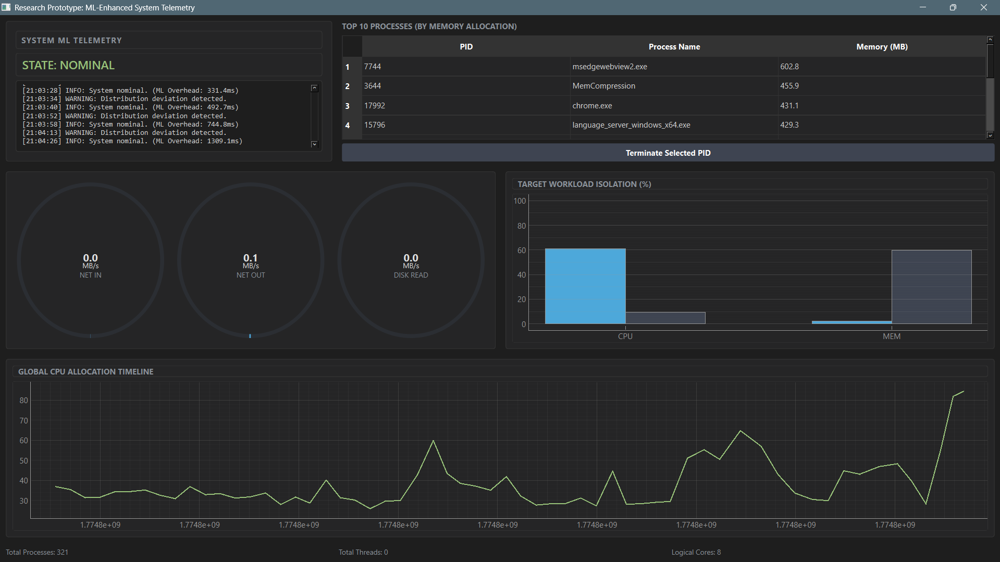
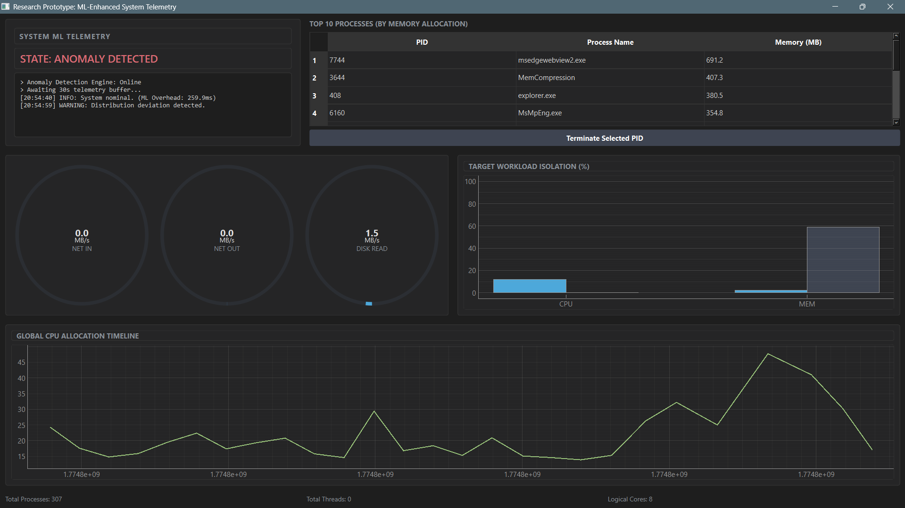

# Advanced System Monitor for Windows 📊

**A Real-Time Performance Analysis Tool with Adaptive Anomaly Detection**

[](https://doi.org/10.5281/zenodo.19427836)
[](https://www.python.org/downloads/release/python-3110/)
[](https://opensource.org/licenses/MIT)
[](https://www.microsoft.com/windows)
[]()

> **Note to Reviewers:** This repository contains the official source code, compiled executable, and evaluation data for the paper *"Advanced System Monitor for Windows: A Real-Time Performance Analysis Tool with Adaptive Anomaly Detection"* by Dhruv Dhoundiyal, Chintu Kadian, and Kiran Kumar M — Vellore Institute of Technology, Chennai, India.

---

## 📚 Table of Contents

- [Abstract](#-abstract)
- [Key Features](#-key-features)
- [How It Works](#-how-it-works)
- [Dashboard Preview](#️-dashboard-preview)
- [Project Structure](#-project-structure)
- [Quick Start](#️-quick-start-running-from-source)
- [Dependencies](#-dependencies)
- [Download the Executable](#-download-the-executable)
- [Experimental Results](#-experimental-results)
- [Citation](#-citation)
- [License](#-license)

---

## 📝 Abstract

Contemporary workstations run heterogeneous workloads — containerized microservices, C++ compilation pipelines, and telemetry agents — that contend for finite hardware resources. Traditional monitoring tools like Windows Task Manager are **observational, not analytical**: they cannot distinguish nominal state transitions from structural anomalies, nor detect compound multi-metric failures where no single metric crosses a threshold.

This framework presents a self-contained, real-time system monitor for Windows that uses an **Isolation Forest** model, continuously retrained on a 300-second rolling window of live CPU, memory, and disk I/O data, to enable adaptive anomaly detection without predefined thresholds.

Evaluated on an Intel Core i5-1135G7 workstation (Windows 11, 16 GB DDR4, NVMe SSD), the system achieved:

| Metric | Value |
| :--- | :--- |
| Precision | 0.625 |
| Recall | 0.539 |
| **F1-Score** | **0.579** |
| Improvement over Z-Score baseline | **+55%** |
| CPU Overhead | 1.8% |
| RAM Overhead | 62 MB |
| ML Inference Latency | 4.2 ms |

---

## 🚀 Key Features

| Feature | Description |
| :--- | :--- |
| **Rolling Window Adaptive Detection** | A 300-second rolling buffer continuously retrains the Isolation Forest, adapting to concept drift and preventing alert fatigue from legitimate workload ramps. |
| **Semantic Workload Isolation** | Splits running processes into user-space (IDE, browser, containers) and system-space (kernel threads, service hosts) groups, enabling faster root-cause diagnosis. |
| **Observer Effect Mitigation** | A dedicated self-profiling thread tracks the monitor's own CPU and RAM footprint and subtracts it from the telemetry stream before Isolation Forest ingestion. |
| **Asynchronous Decoupling** | Four independent threads communicate only via `queue.Queue`, ensuring the 1 Hz UI render loop never blocks the 0.2 Hz ML inference loop. |
| **Low Overhead** | Full retraining, workload isolation, self-profiling, and rendering combined cost only **1.8% CPU** and **62 MB RAM**. |

---

## 🔬 How It Works

The system operates on a three-layer asynchronous architecture:
```
┌─────────────────────────────────────────────────────────────┐
│              TELEMETRY LAYER  —  1 Hz                        │
│  psutil polls: CPU% · RAM% · Disk Read MB/s · Disk Write MB/s│
│  Self-Profiling Thread subtracts monitor's own footprint     │
│  Feature vector xt ∈ ℝ⁴ → appended to rolling deque(300)    │
└────────────────────────┬────────────────────────────────────┘
                         │  thread-safe queue.Queue
┌────────────────────────▼────────────────────────────────────┐
│              ML LAYER  —  0.2 Hz (every 5 seconds)           │
│  Requires ≥ 50 samples in deque before scoring               │
│  StandardScaler fit → IsolationForest retrain (100 trees)    │
│  decision_function < 0  →  anomaly flag + severity badge     │
└────────────────────────┬────────────────────────────────────┘
                         │  thread-safe queue.Queue
┌────────────────────────▼────────────────────────────────────┐
│              UI LAYER  —  1 Hz  (PyQt6 main thread)          │
│  Live time-series plots · Stacked workload bars · Alerts     │
│  Red vertical line on anomaly · JSON log entry written       │
└─────────────────────────────────────────────────────────────┘
```

**Why Isolation Forest?**
- **O(n) time complexity** — fully retrained every 5 seconds on the monitored host without measurable impact
- **No labeled fault data required** — fully unsupervised, suitable for desktops with no historical fault logs
- **Multivariate joint scoring** — detects compound anomalies that univariate Z-score methods miss entirely

**Why a 300-second window?**
Experimentally determined: 30-second windows over-react to transient spikes; 10-minute windows absorb sustained anomalies into the baseline. Five minutes balances sensitivity and specificity across all three stress categories tested.

---

## 🖼️ Dashboard Preview

| Normal Operation | CPU Stress Event |
| :---: | :---: |
|  |  |

---

## 📁 Project Structure
```
ML_System_Monitor/
│
├── docs/                      # Dashboard screenshots and paper figures
├── main.py                    # Application entry point
├── stress_test.py             # Stress testing script (CPU, RAM, Disk I/O)
├── ML_System_Monitor.spec     # PyInstaller build specification
├── requirements.txt           # Python dependencies
├── LICENSE                    # MIT License
└── README.md                  # This file
```

> `build/`, `dist/`, and `venv/` are excluded via `.gitignore`. The compiled executable is available in the [Releases Tab](https://github.com/force2speed/ML_System_Monitor/releases) and on [Zenodo](https://doi.org/10.5281/zenodo.19427836).

---

## ⚙️ Quick Start (Running from Source)

**Prerequisites:** Windows 10/11, Python 3.11+

1. **Clone the repository:**
```bash
git clone https://github.com/force2speed/ML_System_Monitor.git
cd ML_System_Monitor
```

2. **Install dependencies:**
```bash
pip install -r requirements.txt
```

3. **Run the monitor:**
```bash
python main.py
```

> ⚠️ **Run as Administrator.** Required for `psutil` to access system-wide disk I/O metrics via the Windows PDH API. Without elevated privileges, disk throughput metrics will be incomplete.

**To run the stress tests used in the paper's evaluation:**
```bash
python stress_test.py
```

---

## 📦 Dependencies

| Package | Version | Purpose |
| :--- | :--- | :--- |
| `psutil` | ≥ 5.9 | System telemetry via Windows PDH API and `GetSystemTimes()` |
| `scikit-learn` | ≥ 1.3 | `IsolationForest` and `StandardScaler` |
| `numpy` | ≥ 1.24 | Rolling deque → NumPy matrix for ML ingestion |
| `PyQt6` | ≥ 6.5 | GUI event loop and UI rendering |
| `matplotlib` | ≥ 3.7 | Live time-series plots via `FigureCanvasQTAgg` |

---

## 💾 Download the Executable

For reviewers who do not wish to configure a Python environment:

1. Navigate to the [**Releases Tab**](https://github.com/force2speed/ML_System_Monitor/releases).
2. Download `ML_System_Monitor.exe` from the latest release.
3. Run as **Administrator** (required for full disk I/O telemetry access).

> Packaged with PyInstaller and available on Zenodo: [10.5281/zenodo.19427836](https://doi.org/10.5281/zenodo.19427836) — no Python installation required.

---

## 🧪 Experimental Results

### Test Environment

| Component | Specification |
| :--- | :--- |
| OS | Windows 11 Home |
| CPU | Intel Core i5-1135G7 (4 cores, 8 logical processors) |
| RAM | 16 GB DDR4 |
| Storage | Samsung MZALQ512HBLU NVMe SSD |

### Detection Accuracy

| Metric | Value |
| :--- | :--- |
| Precision | 0.625 |
| Recall | 0.539 |
| **F1-Score** | **0.579** |

### Baseline Comparison

| Method | F1-Score | vs. Proposed |
| :--- | :--- | :--- |
| **Proposed (Rolling Isolation Forest)** | **0.579** | — |
| Static Threshold Monitor | 0.412 | −29% |
| Univariate Z-Score Detector | 0.373 | −55% |

### Per-Category Detection (15/15 stress events detected)

| Stress Category | Detected | Missed | Mean Detection Latency |
| :--- | :---: | :---: | :--- |
| CPU Saturation (10–20% → 94–98%) | 5/5 | 0 | 3.5 s |
| Disk I/O Saturation | 5/5 | 0 | 7.2 s |
| Memory Pressure (128 MB/step) | 5/5 | 0 | 6.1 s |

### Resource Overhead

| Tool | CPU Overhead | RAM |
| :--- | :--- | :--- |
| Windows Performance Monitor | 0.9% | 38 MB |
| Windows Task Manager | 1.2% | 45 MB |
| **Proposed ML Monitor** | **1.8%** | **62 MB** |

---

## 📖 Citation

If you use this software or reference this work, please cite:
```bibtex
@article{dhoundiyal2025sysmonitor,
  author    = {Dhruv Dhoundiyal and Chintu Kadian and Kiran Kumar M},
  title     = {Advanced System Monitor for Windows: A Real-Time Performance
               Analysis Tool with Adaptive Anomaly Detection},
  year      = {2025},
  publisher = {Zenodo},
  doi       = {10.5281/zenodo.19427836},
  url       = {https://doi.org/10.5281/zenodo.19427836}
}
```

---

## 📄 License

This project is licensed under the **MIT License** — see the [LICENSE](LICENSE) file for details.

---

<p align="center">
  Department of Computer Science · Vellore Institute of Technology, Chennai, India<br>
  <a href="mailto:dhruvdhoundiyal@gmail.com">dhruvdhoundiyal@gmail.com</a> ·
  <a href="mailto:chintu.kadian2023@vitstudent.ac.in">chintu.kadian2023@vitstudent.ac.in</a> ·
  <a href="mailto:kirankumar.m@vit.ac.in">kirankumar.m@vit.ac.in</a>
</p>